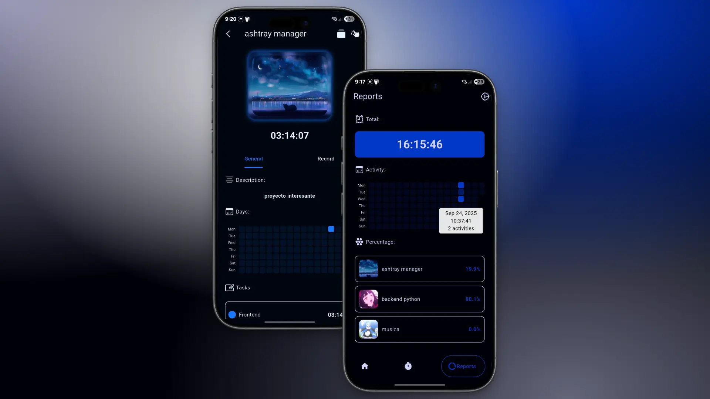

# Project TrackBuzz

project to track the time of projects, tasks or exercises


## Technology Stack

[]()

**Client:** Flutter

**Server:** Sqlite

## Run Locally

Clone the project

```bash
git clone https://github.com/Corro-Kun/Project-TrackBuzz.git
```

Go to the project directory

```bash
cd Project-TrackBuzz
```

Install dependencies

```bash
flutter pub get
```

Start the app

```bash
flutter run
```

## Screenshots


<br>
<br>


## Color Reference

| Color             | Hex                                                                |
| ----------------- | ------------------------------------------------------------------ |
| Color Primary |  #590253 |
| Color Secondary |  #0D0D0D |
| Color Text |  #F2F2F2 |

## Contributing

Contributions are always welcome!

# Thank you for reading

<p align="center">~ Corro-Kun ~</p>
